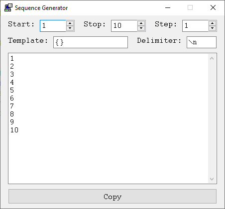

# Sequence Generator
Generate number sequences

I often find myself writing loops for some number sequences, so I wrote this generator.

Features:
- Generate numbers from start to stop, increment by step, just like the for-loop.
- Start can be greater than Stop, you can generate numbers in reverse.
- Step can be zero, which will make Stop the count of numbers to generate.
- Template is fed into the [Format](https://www.autohotkey.com/docs/v2/lib/Format.htm) function, supporting any format option defined in the docs.

Forum post: https://www.autohotkey.com/boards/viewtopic.php?f=83&t=110941

Download: [Releases](./releases)
